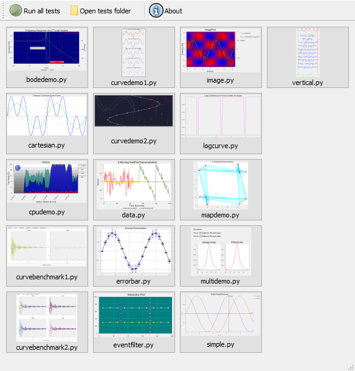
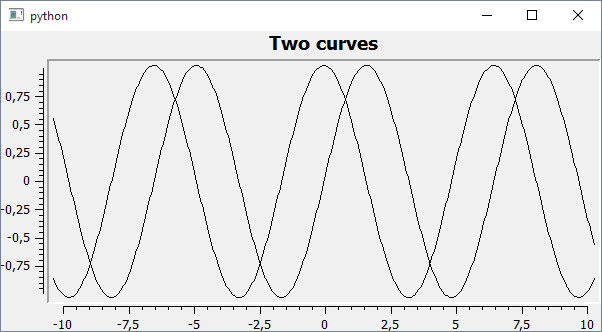
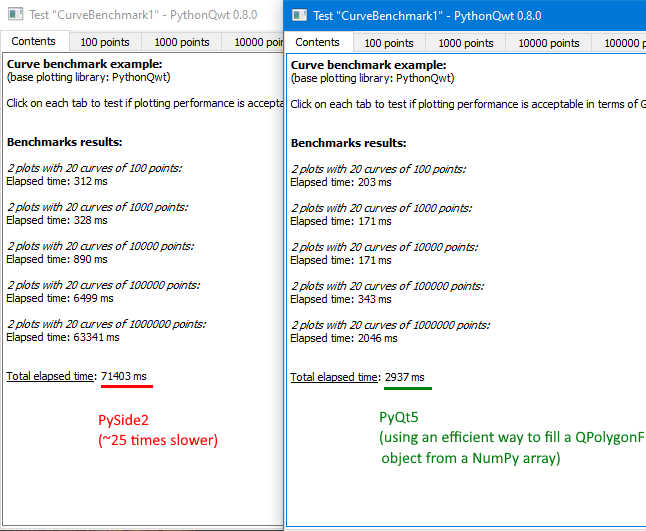

# PythonQwt: Qt plotting widgets for Python

[](./LICENSE)
[](https://pypi.org/project/PythonQwt/)
[](https://github.com/PierreRaybaut/PythonQwt)
[](https://pypi.python.org/pypi/PythonQwt/)
[](https://www.anaconda.com/download/)
[](https://pythonqwt.readthedocs.io/en/latest/?badge=latest)



The `PythonQwt` project was initiated to solve -at least temporarily- the
obsolescence issue of `PyQwt` (the Python-Qwt C++ bindings library) which is
no longer maintained. The idea was to translate the original Qwt C++ code to
Python and then to optimize some parts of the code by writing new modules
based on NumPy and other libraries.

The `PythonQwt` package consists of a single Python package named `qwt` and
of a few other files (examples, doc, ...).

See documentation [online](https://pythonqwt.readthedocs.io/en/latest/) or [PDF](https://pythonqwt.readthedocs.io/_/downloads/en/latest/pdf/) for more details on the library and [changelog](CHANGELOG.md) for recent history of changes.

## Sample

```python
import qwt
import numpy as np

app = qwt.qt.QtGui.QApplication([])

# Create plot widget
plot = qwt.QwtPlot("Trigonometric functions")
plot.insertLegend(qwt.QwtLegend(), qwt.QwtPlot.BottomLegend)

# Create two curves and attach them to plot
x = np.linspace(-10, 10, 500)
qwt.QwtPlotCurve.make(x, np.cos(x), "Cosinus", plot, linecolor="red", antialiased=True)
qwt.QwtPlotCurve.make(x, np.sin(x), "Sinus", plot, linecolor="blue", antialiased=True)

# Resize and show plot
plot.resize(600, 300)
plot.show()

app.exec_()
```



## Examples (tests)

The GUI-based test launcher may be executed from Python:

```python
from qwt import tests
tests.run()
```

or from the command line (script name depends on Python major version number):

```bash
PythonQwt-py3
```

Tests may also be executed in unattended mode:

```bash
PythonQwt-tests-py3 --mode unattended
```

## Overview

The `qwt` package is a pure Python implementation of `Qwt` C++ library with
the following limitations.

The following `Qwt` classes won't be reimplemented in `qwt` because more
powerful features already exist in `guiqwt`: `QwtPlotZoomer`,
`QwtCounter`, `QwtEventPattern`, `QwtPicker`, `QwtPlotPicker`.

Only the following plot items are currently implemented in `qwt` (the only
plot items needed by `guiqwt`): `QwtPlotItem` (base class), `QwtPlotItem`,
`QwtPlotMarker`, `QwtPlotSeriesItem` and `QwtPlotCurve`.

See "Overview" section in [documentation](https://pythonqwt.readthedocs.io/en/latest/)
for more details on API limitations when comparing to Qwt.

## Dependencies

### Requirements

- Python >=2.6 or Python >=3.2
- PyQt4 >=4.4 or PyQt5 >= 5.5 (or PySide2, still experimental, see below)
- QtPy >= 1.3
- NumPy >= 1.5

### Why PySide2 support is still experimental



Try running the `curvebenchmark1.py` test with PyQt5 and PySide: you will notice a
huge performance issue with PySide2 (see screenshot above). This is due to the fact
that `QPainter.drawPolyline` is much more efficient in PyQt5 than it is in PySide2
(see [this bug report](https://bugreports.qt.io/projects/PYSIDE/issues/PYSIDE-1366)).

As a consequence, until this bug is fixed in PySide2, we still recommend using PyQt5
instead of PySide2 when it comes to representing huge data sets.

However, PySide2 support was significatively improved betwen PythonQwt V0.8.0 and
V0.8.1 thanks to the new `array2d_to_qpolygonf` function (see the part related to
PySide2 in the code below).

```python
def array2d_to_qpolygonf(xdata, ydata):
    """
    Utility function to convert two 1D-NumPy arrays representing curve data
    (X-axis, Y-axis data) into a single polyline (QtGui.PolygonF object).
    This feature is compatible with PyQt4, PyQt5 and PySide2 (requires QtPy).

    License/copyright: MIT License © Pierre Raybaut 2020.

    :param numpy.ndarray xdata: 1D-NumPy array (numpy.float64)
    :param numpy.ndarray ydata: 1D-NumPy array (numpy.float64)
    :return: Polyline
    :rtype: QtGui.QPolygonF
    """
    dtype = np.float64
    if not (
        xdata.size == ydata.size == xdata.shape[0] == ydata.shape[0]
        and xdata.dtype == ydata.dtype == dtype
    ):
        raise ValueError("Arguments must be 1D, float64 NumPy arrays with same size")
    size = xdata.size
    polyline = QPolygonF(size)
    if PYSIDE2:  # PySide2 (obviously...)
        address = shiboken2.getCppPointer(polyline.data())[0]
        buffer = (ctypes.c_double * 2 * size).from_address(address)
    else:  # PyQt4, PyQt5
        buffer = polyline.data()
        buffer.setsize(2 * size * np.finfo(dtype).dtype.itemsize)
    memory = np.frombuffer(buffer, dtype)
    memory[: (size - 1) * 2 + 1 : 2] = xdata
    memory[1 : (size - 1) * 2 + 2 : 2] = ydata
    return polyline
```

## Installation

From the source package:

```bash
python setup.py install
```

## Copyrights

### Main code base

- Copyright © 2002 Uwe Rathmann, for the original Qwt C++ code
- Copyright © 2015 Pierre Raybaut, for the Qwt C++ to Python translation and
optimization
- Copyright © 2015 Pierre Raybaut, for the PythonQwt specific and exclusive
Python material

### PyQt, PySide and Python2/Python3 compatibility modules

- Copyright © 2009-2013 Pierre Raybaut
- Copyright © 2013-2015 The Spyder Development Team

### Some examples

- Copyright © 2003-2009 Gerard Vermeulen, for the original PyQwt code
- Copyright © 2015 Pierre Raybaut, for the PyQt5/PySide port and further
developments (e.g. ported to PythonQwt API)

## License

The `qwt` Python package was partly (>95%) translated from Qwt C++ library:
the associated code is distributed under the terms of the LGPL license. The
rest of the code was either wrote from scratch or strongly inspired from MIT
licensed third-party software.

See included [LICENSE](LICENSE) file for more details about licensing terms.
